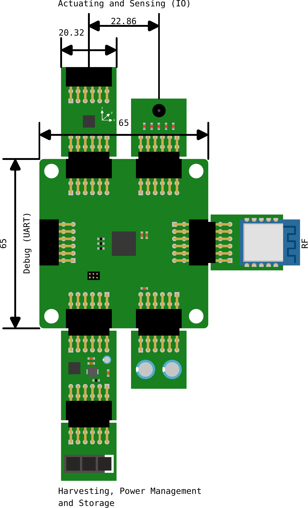

# Modular Energy-Neutral Device Platform

A modular, research-oriented hardware and software platform for **energy-neutral and backscatter-based IoT systems**.

This platform is developed to enable **rapid prototyping, fair comparison, and reproducible research** across sensing, energy harvesting, power management, storage, and RF backscatter communication.

The core idea is simple:  
**split an IoT node into clearly defined, stackable subsystems**, each with its own lifecycle, power domain, and research focus.

*Modular backscatter platform overview (click to open PDF).*

---

## Why this platform?

Most existing battery-free or energy-neutral IoT platforms lock in key design choices early:
- fixed MCU
- fixed harvesting IC
- fixed RF front-end
- limited observability

This platform does the opposite.

**You can swap:**
- MCUs vs FPGAs  
- harvesters (RF, solar, vibration, capacitive)  
- storage (caps, supercaps, batteries)  
- backscatter architectures (fully digital → IQ-based)  

without redesigning the full node.

---

## Architecture Overview

The platform consists of a **main board** and multiple **stackable daughter boards** connected via standardized 12-pin interfaces inspired by the Digilent PMOD specification.

Each daughter board represents **one function only**.

Typical stacks:
- sensing + harvesting + storage
- harvesting + power management + RF backscatter
- MCU + RF + debug

Key properties:
- shared pinout across all connectors
- per-board load switching
- independent power domains
- stackable SPI / I²C / UART support
- explicit debug access

---

## Repository Structure (Logical)

This repository acts as the **index and umbrella** for the full platform.

Each block below links to a **dedicated repository** containing schematics, PCB files, firmware, and documentation.

> All links are placeholders and will be populated incrementally.

---

## Core Hardware

### Main Board
The computational core (MCU or FPGA).

- Target MCUs: STM32U0, MSPM0C1104, nRF54, STM32WL55
- Optional FPGA variants for exploratory research

Repository:
- 🔗 `TODO: link to main-board repository`

---

## Sensors

Environmental and contextual sensing modules.

Planned boards include:
- Motion / IMU (ICM-20948)
- Temperature & humidity (BME280)
- Ambient light (VEML6035)
- Microphone / acoustic sensing

Repositories:
- 🔗 `TODO: sensor-imu`
- 🔗 `TODO: sensor-temp-humidity`
- 🔗 `TODO: sensor-light`
- 🔗 `TODO: sensor-microphone`

---

## Actuators

Modules that actively interact with the environment.

Planned:
- Electronic shelf labels
- Low-power visual or mechanical actuators

Repositories:
- 🔗 `TODO: actuator-esl`
- 🔗 `TODO: actuator-generic`

---

## Power Management

Boards responsible for:
- voltage regulation
- power multiplexing
- MPPT
- energy-aware enable/disable logic

These boards define **how energy is consumed**, not how it is harvested.

Repositories:
- 🔗 `TODO: power-management-basic`
- 🔗 `TODO: power-management-mppt`

---

## Energy Harvesting

Dedicated harvesters, stackable and swappable.

Planned harvesting sources:
- Indoor solar
- Outdoor solar
- RF energy harvesting
- Capacitive harvesting (mains fields)
- Vibration harvesting

Repositories:
- 🔗 `TODO: harvester-solar-indoor`
- 🔗 `TODO: harvester-solar-outdoor`
- 🔗 `TODO: harvester-rf`
- 🔗 `TODO: harvester-capacitive`
- 🔗 `TODO: harvester-vibration`

---

## Energy Storage

Boards providing **only storage**, no regulation.

Planned storage types:
- Ceramic capacitors
- Supercapacitors
- Rechargeable batteries

Repositories:
- 🔗 `TODO: storage-ceramic`
- 🔗 `TODO: storage-supercap`
- 🔗 `TODO: storage-battery`

---

## RF Front-End

Wireless connectivity and backscatter modulation.

Supported and planned approaches:
- Active LoRa transceivers
- Impedance-network backscatter
- IQ-modulator backscatter
- Digital IQ backscatter (PWM-based)
- Fully digital backscatter (RF switch)

Repositories:
- 🔗 `TODO: rf-lora-transceiver`
- 🔗 `TODO: rf-backscatter-impedance`
- 🔗 `TODO: rf-backscatter-iq`
- 🔗 `TODO: rf-backscatter-digital`

---

## Firmware & Software

Software is split by responsibility:
- main board firmware
- per-module drivers
- experiment control
- data logging and analysis

Repositories:
- 🔗 `TODO: firmware-mainboard`
- 🔗 `TODO: firmware-drivers`
- 🔗 `TODO: experiment-control`
- 🔗 `TODO: data-analysis-tools`

---

## Design Goals and Constraints

- Energy-neutral by design
- Modular at PCB level
- Explicit power domain separation
- Lifecycle-aware hardware design (LCA)
- Research-grade observability
- Close-to-commercial implementations where possible

---

## Target Applications

The platform explicitly supports:
- plant and environmental monitoring
- e-waste tracking
- logistics and asset monitoring
- animal tracking
- residential sensing
- patient and wearable monitoring

No application is hard-coded into the hardware.

---

## Related and Reference Platforms

This work is informed by, but not limited to:
- Riotee
- WISP (v6)
- ViPSN 2.0
- CapHarvester-based systems

The goal is **maximum flexibility**, not replacement.

---

## Status

🚧 Active development  
This platform is under continuous expansion.  
Expect breaking changes while interfaces stabilize.

---

## Contributing

Contributions are welcome in the form of:
- new modules
- alternative harvesters
- firmware improvements
- validation experiments

Open an issue or start a discussion before submitting large changes.

---

## License

To be defined per sub-repository.  
Hardware and firmware may use different licenses.

---

## Contact

DRAMCO Research Group  
KU Leuven – Ghent Campus

For questions, collaborations, or testbed access, open an issue or reach out directly.
